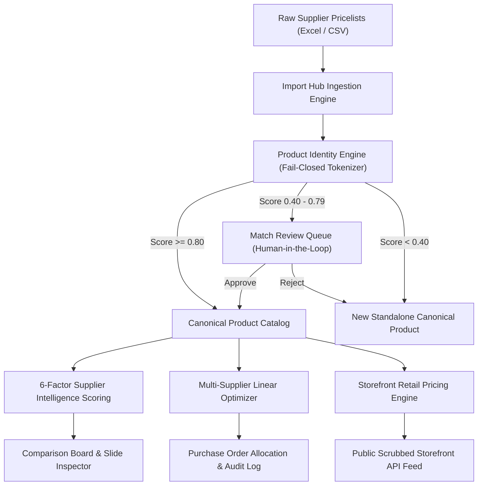
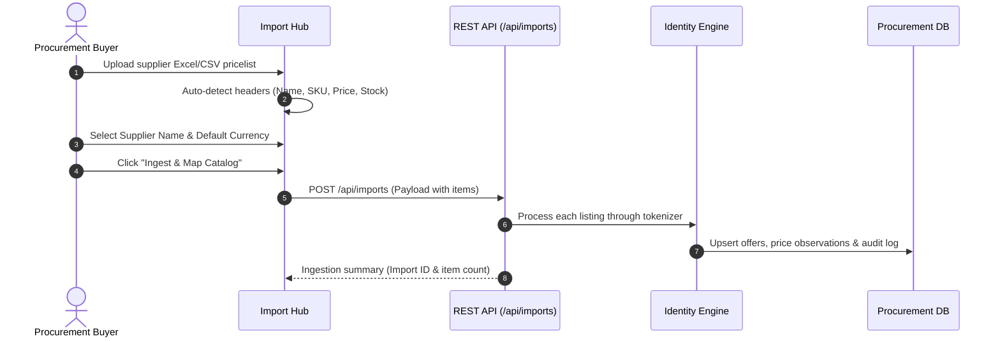
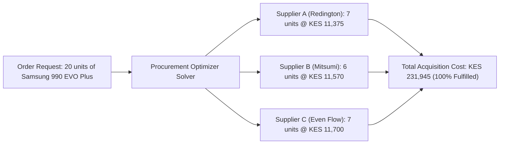

# Supplier Made Easy — Operational User Manual & Tutorial (v3.1)

Welcome to **Supplier Made Easy**, an enterprise **Supplier Intelligence & Procurement Operations Platform** designed for electronics retailers, technology distributors, and commercial procurement teams.

This guide provides end-to-end operational instructions, step-by-step tutorials, keyboard navigation shortcuts, and administrative workflows.

---

## Table of Contents
1. [Platform Architecture & Core Concepts](#1-platform-architecture--core-concepts)
2. [Quickstart & Access](#2-quickstart--access)
3. [Navigation & The Command Shell](#3-navigation--the-command-shell)
4. [Tutorial: Step-by-Step Procurement Workflows](#4-tutorial-step-by-step-procurement-workflows)
   - [Workflow A: Ingesting Supplier Pricelists](#workflow-a-ingesting-supplier-pricelists)
   - [Workflow B: Reviewing & Resolving Product Matches](#workflow-b-reviewing--resolving-product-matches)
   - [Workflow C: Comparing Vendor Quotes & Simulating Margins](#workflow-c-comparing-vendor-quotes--simulating-margins)
   - [Workflow D: Running Multi-Supplier Order Optimization](#workflow-d-running-multi-supplier-order-optimization)
   - [Workflow E: Monitoring Price Trends & Market Volatility](#workflow-e-monitoring-price-trends--market-volatility)
   - [Workflow F: Configuring Retail Storefront Pricing Rules](#workflow-f-configuring-retail-storefront-pricing-rules)
5. [Role-Based Access Control (RBAC) & Security](#5-role-based-access-control-rbac--security)
6. [Administration & Scoring Formula Customization](#6-administration--scoring-formula-customization)
7. [API Quick Reference & Examples](#7-api-quick-reference--examples)
8. [Troubleshooting & FAQ](#8-troubleshooting--faq)

---

## 1. Platform Architecture & Core Concepts



### Core Business Pillars

| Concept | Purpose | How It Works |
| :--- | :--- | :--- |
| **Canonical Product** | Single source of truth for an identical SKU across vendors. | Reconciles disparate vendor naming (`"Samsung 990 EVO Plus 1TB"` vs `"SAMSUNG SSD 1TB NVME 990 EVO PLUS"`). |
| **Base Currency (KES)** | Universal economic baseline. | All quotes in USD, EUR, or GBP are normalized to Kenyan Shillings (KES) using live exchange rates. |
| **Supplier Intelligence** | 6-metric composite rating (0–100). | Evaluates **Price** (30%), **Stock** (20%), **Reliability** (20%), **Delivery Speed** (10%), **Warranty** (10%), and **Freshness** (10%). |
| **Multi-Supplier Optimizer** | Linear cost minimization under stock constraints. | Splits purchase orders across lowest-cost qualified suppliers when no single vendor has sufficient stock. |
| **Scrubbed Public Feed** | Clean storefront export without leaking economics. | Automatically strips vendor names, wholesale acquisition costs, and supplier scores from public feeds. |

---

## 2. Quickstart & Access

### Starting the Application Locally
Supplier Made Easy runs as a Docker container or via standard Node.js development scripts:

```bash
# Option 1: Docker (Recommended for Production / Staging)
docker compose up -d --build

# Option 2: Local Node.js Development
npm install
npm test
npm run dev
```

- **Web Application URL**: [`http://localhost:3000`](http://localhost:3000)
- **API Health Check**: [`http://localhost:3000/api/health`](http://localhost:3000/api/health)

---

## 3. Navigation & The Command Shell

The application is built around a **keyboard-first Command Shell** designed for high-throughput procurement operations.

### Global Keyboard Shortcuts

| Shortcut | Action | Scope |
| :--- | :--- | :--- |
| `⌘ K` / `Ctrl + K` | Open Universal Command Palette | Global |
| `/` | Focus Global Product Search Box | Global (when not inside inputs) |
| `P` | Jump to **Catalog & Comparison Matrix** | Global |
| `S` | Jump to **Supplier Directory** | Global |
| `O` | Jump to **Procurement Optimizer** | Global |
| `T` | Jump to **Price Trends & Analytics** | Global |
| `Q` | Jump to **Match Review Queue** | Global |
| `I` | Open **Pricelist Import Hub** | Global |
| `?` | Open **Keyboard Shortcuts Guide** | Global |
| `ESC` | Close active drawer, modal, or palette | Global |

---

## 4. Tutorial: Step-by-Step Procurement Workflows

---

### Workflow A: Ingesting Supplier Pricelists



#### Step-by-Step Guide:
1. Press `I` or click **Import** in the top navigation bar.
2. Select or enter the **Supplier Name** (e.g. *Redington Middle East*, *Mitsumi Distribution*).
3. Select the **Pricelist Currency** (e.g. `USD`, `KES`, `EUR`).
4. Drag and drop your `.xlsx`, `.xls`, or `.csv` pricelist into the upload dropzone.
5. Review the **Column Auto-Detection**:
   - **Product Name Column**: e.g., `Description`, `Product Name`, `Item`
   - **SKU / MPN Column**: e.g., `Part Number`, `Model SKU`, `Item Code`
   - **Wholesale Price Column**: e.g., `Price USD`, `Unit Cost`, `Wholesale`
   - **Stock Column**: e.g., `Stock Qty`, `Availability`, `Qty`
6. Click **Ingest & Process Catalog**. The engine automatically normalizes all items, updates price observations, and queues any ambiguous matches.

---

### Workflow B: Reviewing & Resolving Product Matches

When two supplier listings look similar but have slight naming variations, the system places them into the **Match Review Queue** (Confidence between 0.40 and 0.79).

```
┌─────────────────────────────────────────────────────────────────────────────┐
│ MATCH REVIEW QUEUE (3 items pending review)                                 │
├─────────────────────────────────────────────────────────────────────────────┤
│ Pending Match #1  [Similarity: 0.75]                                       │
│ Supplier A: Mitsumi Distribution                                            │
│ Listing: "Samsung 990 EVO Plus 1TB PCIe 4.0 NVMe M.2" (USD $89.00)          │
│                                                                             │
│ Candidate: Redington Kenya                                                  │
│ Listing: "SAMSUNG SSD 1TB NVME 990 EVO PLUS" (USD $87.50)                   │
│                                                                             │
│ Signals: Brand Match: SAMSUNG | Exact Model: 990 EVO PLUS | Capacity: 1TB   │
│                                                                             │
│ [A] Approve Match & Merge          [R] Reject Match (Keep Standalone)       │
└─────────────────────────────────────────────────────────────────────────────┘
```

#### Review Actions:
- Press `A` or click **Approve Match**: Confirms both listings represent the exact same product. They merge under one canonical product so you can compare their prices directly.
- Press `R` or click **Reject**: Classifies them as distinct products. The listing becomes its own standalone canonical item.
- Press `↓` / `↑`: Move down or up through the review queue without taking your hands off the keyboard.

---

### Workflow C: Comparing Vendor Quotes & Simulating Margins

1. Press `P` or click **Comparison Board** to view the main catalog matrix.
2. Type in the search box (or press `/`) to find any SKU (e.g., `990 PRO`, `XPS 15`, `MX Master`).
3. Each product row displays:
   - **Best Price (KES)** with currency tag.
   - **Potential Savings**: Difference between the highest and lowest quoted supplier price.
   - **Recommended Supplier**: Highlighted based on composite 6-factor intelligence.
4. Click **Inspect** on any product to open the **Slide-Out Inspector Drawer**:
   - View complete multi-vendor quotation breakdown.
   - Use the **Interactive Margin Simulator**:
     - Adjust the **Target Sell Price (KES)**.
     - View instant calculation of **Gross Profit (KES)** and **Gross Margin %**.

---

### Workflow D: Running Multi-Supplier Order Optimization

When ordering large quantities across distributors with limited stock, the **Procurement Optimizer** solves for minimum acquisition cost.



#### Step-by-Step Optimization:
1. Press `O` or click **Optimizer** in the top navigation bar.
2. Select the target product and enter the **Required Quantity** (e.g. `20`).
3. Select your **Optimization Policy**:
   - **Best Value (Recommended)**: Balances lowest cost with supplier reliability score.
   - **Lowest Price**: Strictly minimizes total purchase cost.
   - **Fastest Delivery**: Prioritizes suppliers with lowest average lead time.
   - **Maximum Stock Availability**: Minimizes the number of split orders.
4. Click **Run Optimizer**.
5. Review the **Multi-Supplier Allocation Breakdown**.
6. Click **Commit Sourcing Decision** to lock the allocation and generate draft purchase orders.

---

### Workflow E: Monitoring Price Trends & Market Volatility

1. Press `T` or click **Price Trends**.
2. Review market movement indicators:
   - **Recent Price Drops**: Opportunities to acquire inventory at discount.
   - **Price Increases**: Advance notice of vendor cost escalation.
   - **30-Day Volatility Index**: Identifies products with unstable wholesale pricing.
   - **Observation Count & Confidence**: Tracks how many data points back up the trend.

---

### Workflow F: Configuring Retail Storefront Pricing Rules

To sync procurement costs into consumer-facing retail prices without exposing internal margins:

1. Navigate to **Storefront Sync** in the management rail.
2. Select your global pricing strategy:
   - **Markup on Cost**: `Retail = Wholesale Cost × (1 + Markup %)`
   - **Target Gross Margin**: `Retail = Wholesale Cost ÷ (1 - Margin %)`
   - **Cost + Fixed Surcharge**: `Retail = Wholesale Cost + Fixed KES Amount`
   - **Fixed Price**: Absolute retail price overriding acquisition cost.
3. Review the **Scrubbed Public Storefront Feed Preview**:
   - Public feed includes only: `product_id`, `canonical_name`, `category`, `retail_price`, `currency`, `in_stock`.
   - All supplier identities, wholesale costs, margins, and ratings are automatically redacted.

---

## 5. Role-Based Access Control (RBAC) & Security

The platform enforces strict role verification on all mutating routes:

| Role | Permissions | Typical User |
| :--- | :--- | :--- |
| **`admin`** | Full access: update FX rates, customize formula weights, create suppliers, modify pricing strategies. | Procurement Director, Platform Administrator |
| **`buyer`** | Ingest pricelists, approve/reject match suggestions, merge/split products, execute procurement optimizer decisions. | Senior Buyer, Purchasing Manager |
| **`viewer`** | Read-only access: browse catalog, view comparison matrices, inspect price history. | Inventory Analyst, Finance Auditor |

### Using Authentication in API Calls

Pass the user token in the `Authorization` header:

```bash
# Admin Action (Update exchange rates)
curl -X POST http://localhost:3000/api/exchange-rates \
  -H "Authorization: Bearer admin-token" \
  -H "Content-Type: application/json" \
  -d '{"currency_code": "USD", "rate_to_base": 130.0}'

# Buyer Action (Approve match suggestion)
curl -X POST http://localhost:3000/api/match-suggestions/sug_123/approve \
  -H "Authorization: Bearer buyer-token"
```

---

## 6. Administration & Scoring Formula Customization

Navigate to **Admin Settings** to adjust the 6-factor Supplier Intelligence Formula:

$$\text{Total Score} = w_1 \cdot \text{Price} + w_2 \cdot \text{Stock} + w_3 \cdot \text{Reliability} + w_4 \cdot \text{Delivery} + w_5 \cdot \text{Warranty} + w_6 \cdot \text{Freshness}$$

### Default Production Weights

```
  [0.30] Price Competitiveness   ──────  Relative position between min and max quote
  [0.20] Stock Availability       ──────  Quantity available vs immediate demand
  [0.20] Supplier Reliability     ──────  Track record & fulfillment accuracy (0-10)
  [0.10] Delivery Speed           ──────  Average lead time in business days
  [0.10] Warranty Terms           ──────  Manufacturer / vendor replacement terms
  [0.10] Price Freshness          ──────  Recency of quotation (days since update)
```

Adjust the sliders in **Admin Settings** to fit your operational focus (e.g. increase Reliability weight during critical project delivery windows).

---

## 7. API Quick Reference & Examples

All endpoints return standard JSON responses and require appropriate Bearer tokens for mutations.

### Key Endpoints

| Endpoint | Method | Required Role | Description |
| :--- | :--- | :--- | :--- |
| `/api/canonical-products` | `GET` | *Public / Viewer* | Full catalog with offers and intelligence scores |
| `/api/match-suggestions` | `GET` | *Public / Viewer* | Pending match queue items |
| `/api/match-suggestions/:id/approve` | `POST` | `buyer`, `admin` | Approve match and merge listings |
| `/api/match-suggestions/:id/reject` | `POST` | `buyer`, `admin` | Reject match and keep listing standalone |
| `/api/products/split` | `POST` | `buyer`, `admin` | Split listing into new canonical product |
| `/api/procurement/optimize` | `POST` | *Viewer / Buyer* | Run linear order allocation optimizer |
| `/api/procurement/decide` | `POST` | `buyer`, `admin` | Commit allocation & draft purchase order |
| `/api/exchange-rates` | `POST` | `admin` | Set currency FX conversion rate to KES |
| `/api/admin/settings` | `POST` | `admin` | Update formula weights & global configurations |
| `/api/imports` | `POST` | `buyer`, `admin` | Ingest supplier catalog items |
| `/api/storefront/products` | `GET` | *Public* | Scrubbed retail feed safe for eCommerce |

---

## 8. Troubleshooting & FAQ

### Q: Why did two products not match automatically?
**A:** The engine operates on a **fail-closed** model. If listings have conflicting model modifiers (e.g. `EVO` vs `QVO`, `3` vs `3S`, `PRO` vs base), differing capacities (`1TB` vs `2TB`), or conflicting brands, the engine deliberately downgrades the score to `0.20` to prevent incorrect data merging. You can manually merge them in the Review Queue if appropriate.

### Q: How do I split a product that was mistakenly merged?
**A:** Open the product in the Comparison Board, locate the specific raw listing quote in the Inspector Drawer, and click **Split to New Product**. All offers and price observations for that listing will immediately migrate to the newly created canonical product.

### Q: Where is data stored in Docker?
**A:** Data is persisted in the Docker named volume `supplier_data`, mounted at `/app/server/data/procurement_db.json`. Container restarts and image rebuilds will not lose catalog or pricing data.

### Q: How do I run tests to verify system integrity?
**A:** Run `npm test` from the workspace root. It executes:
1. `tests/matching_regression.test.js` (34 product identity benchmark pairs)
2. `tests/auth.test.js` (RBAC, token validation, audit trail, split integrity)
3. `tests/adversarial.test.js` (Edge-case optimizer, storefront boundary, margin math)

---

*Supplier Made Easy — Enterprise Supplier Intelligence & Procurement Platform (v3.1)*
